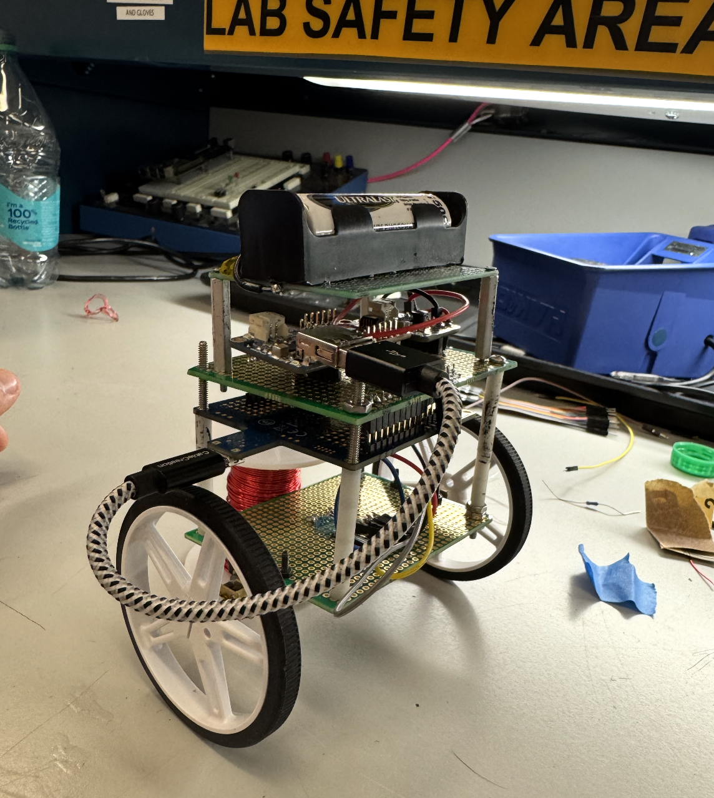
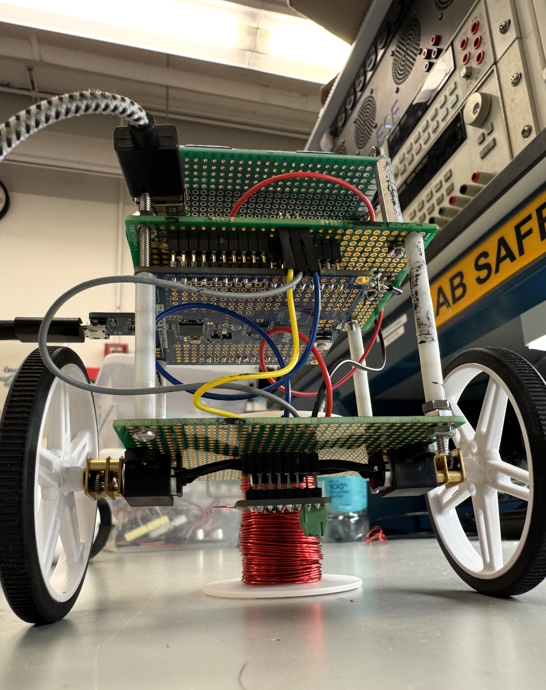
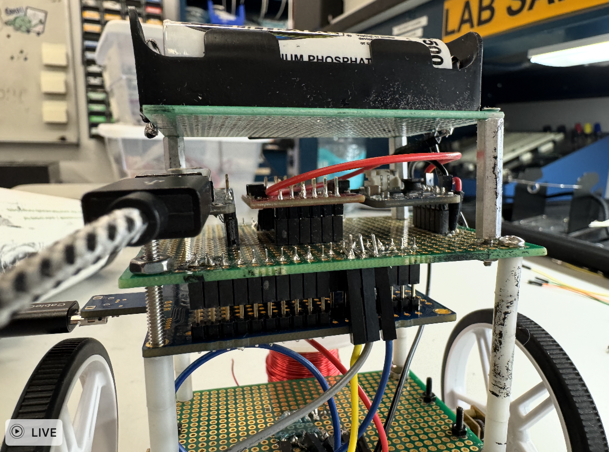
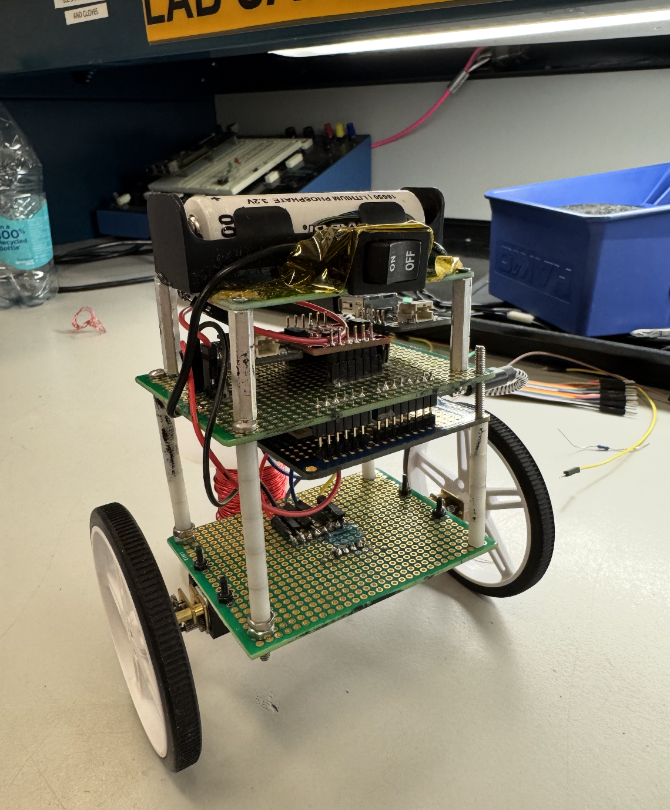
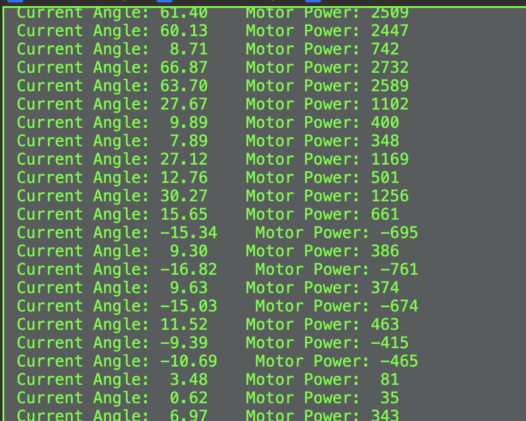
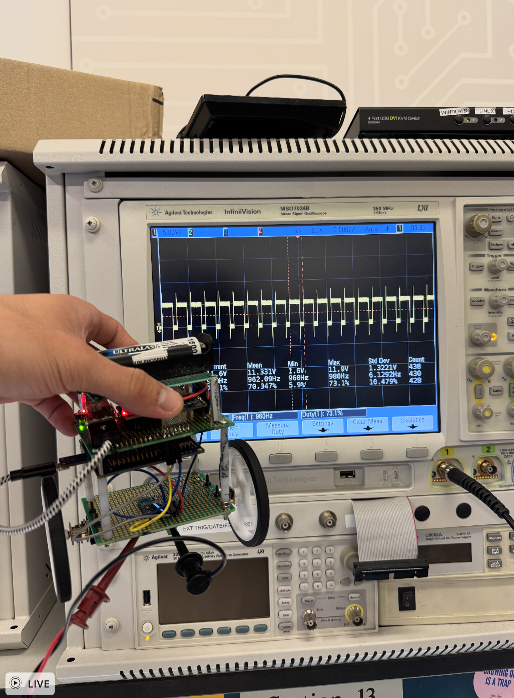
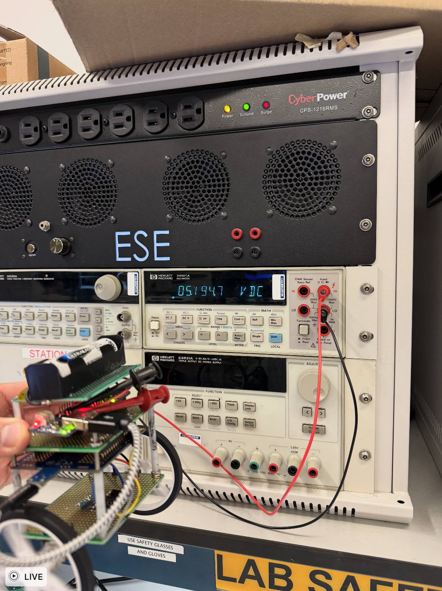

# COD--ESE 3500 Final Project

## Goal

Our goal was to build a Self Balancing Robot using PID control.

## Video Demo

<video controls width="640">
  <source src="COD_FINAL_DEMO.mp4" type="video/mp4">
  Your browser does not support the video tag.
</video>

https://drive.google.com/file/d/1j4oF2RF1gNrmKTKE_TD8yV22seSZAY1A/view?usp=sharing

## Pictures!

|  |  |
| ---------------------------------------------- | ---------------------------------------------- |
|  |  |

## SRS Validation

|                 | Description                                                                                                                                                                                                                                                                                                                                                                   | Met? |
| --------------- | ----------------------------------------------------------------------------------------------------------------------------------------------------------------------------------------------------------------------------------------------------------------------------------------------------------------------------------------------------------------------------- | ---- |
| **SRS 1** | SRS1 was met. The IMU successfully read the gyroscope and accelerometer data, and as a peripheral, and sent the information via I2C to the MCU. This functionality can be tested using the logic analyzer, as the IMU I2C data can be probed using a breadboard. We also verified that the MCU is able to read and use the data by writing to a serial monitor using the MCU. | Yes! |
| **SRS 2** | SRS2 was met. We used a PID control algorithm to control the motors in a way that would hypothetically keep our robot stable. As anticipated, due to the difficulty of testing the algorithm until the final robot was assembled, we completed some functionality testing to see how the feedback loop responded to changes in IMU angle.                                     | Yes! |
| **SRS 3** | SRS3 was met. We used a motor controller to control the movements of 2 DC motors through outputting PWM signals from the MCU. We were able to test this functionality using our motortest.c file by configuring it to write different speeds to the DC motor and seeing how it responds.                                                                                      | Yes! |
| **SRS 4** | SRS4 was met. We configured a PID control loop which required us to use timers and interrupts, in addition to other calculations. The success of this implementation was tested by seeing if our feedback loop was able to spin the wheels properly according to the IMU input, which we verified successfully.                                                               | Yes! |

### SRS 1 Validation

Serial monitor snapshot of angle readings and motor power derived from PID loop.

### SRS 2 Validation

<video controls width="640">
  <source src="COD_SRS2.mp4" type="video/mp4">
  Your browser does not support the video tag.
</video>

https://drive.google.com/file/d/1sBtBPzMcQdFjIWptJwjKo2hV8Ke32LXs/view

## HRS Validation

|                 | Description                                                                                                                                                                                                                                                                                                                                                                                                                                                                                                                                | Met? |
| --------------- | ------------------------------------------------------------------------------------------------------------------------------------------------------------------------------------------------------------------------------------------------------------------------------------------------------------------------------------------------------------------------------------------------------------------------------------------------------------------------------------------------------------------------------------------ | ---- |
| **HRS 1** | HRS1 was met. We were able to setup the IMU information as inputs from the MCU and motor driver commands as outputs. The IMU information was sent via I2C, which we verified by using a logic analyzer. During debugging, we were able to configure the IMU by sending setup commands and receiving feedback. The motor drivers were controlled by outputting variable PWM waves to control the speed and direction of the motors. We did this by using OCR0A and OCR0B pins, and changing the duty cycle to alter the speed of the motor. | Yes! |
| **HRS 2** | HRS2 was met. We were able to send accurate communications between the IMU and ATmega through I2C, which was also implemented ourselves. We verified the integrity of the IMU communications by using a logic analyzer but also physically moving the IMU and seeing the gyroscope and accelerometer values update in real time by communicating with a serial monitor via UART.                                                                                                                                                           | Yes! |
| **HRS 3** | HRS3 was met, although the end goal of the project was not fully met. The motor driver was able to properly receive input signals from the MCU and send the right amount of torque to the motors, which we verified extensively through testing. When the IMU was tilted from its upright position, we could see the speed and direction of the motors adjusting in response.                                                                                                                                                              | Yes! |
| **HRS 4** | HRS4 was met. We were able to accurately vary the speed of the motors by sending PWM signals to the motor drivers and using that to drive the motors. As we tilted the robot to different degrees, it would request different amounts of power (between 0 to 255), and we could visually see the speed of the motor continuously changing, demonstrating how it was working correctly.                                                                                                                                                     | Yes! |
| **HRS 5** | HRS5 was met. Our boost converters were able to step up the battery voltage of 3.2V to 5V to power our peripherals, including our ATmega and motor driver. The isolation of the motor driver and ATmega was essential for protecting the signal integrity of the I2C signals being sent between the IMU and the MCU. We verified this by measuring the voltage output of the boost converter and also seeing that our components were performing as expected by receiving enough power.                                                    | Yes! |

### HRS 4 Validation

PWM Readings from Motor

### HRS 5 Validation

Boost Converter Working!

## Conclusion/Reflection

Overall, we felt that our project was mostly a success. Throughout this project, we learned about the intricacies of control algorithms and the nuances of implementing a PID algorithm to attempt to balance a robot on two wheels. More specifically, we learned about all the different aspects that feed into a control algorithm and cause potential problems. Issues (which we encountered) may stem from inaccurate serial communication between devices, too slow sampling rates, inconsistent motor driving, and hardware/assembly issues such as faulty connections or an unbalanced robot. To have a perfectly functioning control system, all parts must be on the same page with little to no errors anywhere along the project. We also learned a lot about making adjustments on the fly and the integration process of adding different peripherals to all work together. More technically, we learned about implementing a PID algorithm while working with MCUs, interrupts, multiple timers, receiving input from an MCU, and writing outputs to a motor driver.

The process steps we took, from the beginning of the project to end, were successful. We were able to successfully get the individual elements of our project, outlined by our HRS and SRS’s, working, and the mechanical integration of our project also came together well. On the software side, we overcame a lot of challenges we faced in the process of writing our I2C and IMU libraries, as well as in the struggle to increase the responsiveness of our motors to the IMU readings.

During certain trials in our trial process, we were able to get our robot to stand up by itself for a couple of seconds. These instances are documented in our video and the closest we got it to fully functioning, which we are proud of. While our robot never got to fully stand up by itself for extended durations of time, we are also proud of being able to integrate all of the components seamlessly and getting to the point of tuning our PID algorithm. By the end, our motors were able to respond in real time to the positioning and movement of our robot.

In some of our videos, you will see a cup attached to the top of our robot with a weight on top. This was an adjustment that we had to make to the robot while trying to tune it because we determined that for the original setup, the center of gravity was too low for the robot to be able to compensate and balance in time. Thus, we added a cup and a weight to raise the center of gravity to make it easier for the robot to stand, which worked better. We also ran into an issue with our motors where our wheels were spinning at different rates. This is because originally each motor was being independently controlled, and we fixed this issue after using the same inputs to control both motors so that their movements would be mirrored.

Towards the end of our timeline, we finally were able to experiment with more centers of gravity, which we observed had a large impact on how well our robot balanced. We didn’t have a great way of doing this, though, and we ended up taping weights to different sizes of cups which we secured on top of our robot structure. Anticipating the need for adjustments and adding more space on the perf boards for structurally sound COG changes would’ve been helpful in expediting the tuning process. Additionally, we didn’t have a methodological approach to tuning beyond tuning for kp, ki, and kd. We would start with kp and tune the remaining values as best as we could, but then would have to start from scratch again, with or without COG adjustments. We definitely could’ve been more methodical with tabulating our PID value combinations with different COGs and making observations on trends of success. This would’ve provided us a better direction as we were tuning and allowed us to more easily revert to previous states, even if newer trials were unsuccessful.

In addition to factors outside of our control like parts taking several weeks to arrive, we also didn’t anticipate the mechanical element of this project being as influential as it was. There were a lot of software adjustments we needed to make in order to expedite the reaction of the wheel speeds in response to IMU readings, but once these were resolved, we spent a lot of time stuck on tuning PID constants without adjustments to the physical structure of our robot. Once we started changing this, we could see how much it influenced the robot’s ability to balance. Knowing what we know now, we would’ve made an effort to leave even more time to tune and built COG adjustments into a part of that process.

By the end of the project timeline, we found COGs that allowed us to get pretty close to a fully balancing robot. A next step for this project would be finalizing a more secure structure with that COG and refining the PID constants to allow it to fully self-balance for longer durations.
